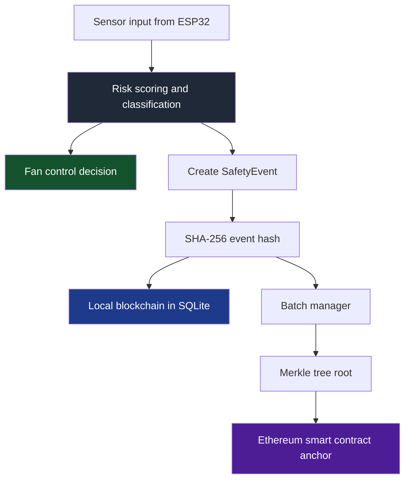

# Blockchain Air Purifier

Tamper-proof IoT safety compliance for an air-purifier system using local blockchain logging, Merkle batching, and Ethereum anchoring.

## Overview

This project separates two concerns that are usually hard to balance in real-world safety systems:

- The safety path must react immediately to sensor readings and control the purifier fan without waiting on slow infrastructure.
- The compliance path must preserve an auditable, tamper-evident record of what happened and when it happened.

To solve that, the system keeps real-time air-quality decisions local while sending cryptographic commitments of batched events to Ethereum. Raw events are hashed, chained in SQLite, grouped into Merkle trees, and anchored on-chain for later verification.

## What The System Does

- Collects safety-relevant readings from an ESP32-based air-purifier setup.
- Computes a risk score from gas, temperature, humidity, and proximity/tool signals.
- Controls fan behavior independently from the blockchain layer.
- Builds a local append-only compliance chain for every processed event.
- Batches event hashes into Merkle roots for cheaper on-chain anchoring.
- Verifies an event end-to-end through hash integrity, Merkle inclusion, and on-chain root matching.

## Architecture



### Design Principles

| Principle | How it is applied |
| --- | --- |
| Safety first | Fan control stays local and is never blocked by blockchain latency |
| Tamper evidence | Event hashing, block chaining, and Merkle commitments expose modification attempts |
| Practical cost control | Only Merkle roots are anchored on-chain instead of full event payloads |
| Independent verification | Auditors can recompute hashes, validate proofs, and compare roots against Ethereum |
| Modular pipeline | Python compliance modules, Solidity contract, and ESP32 test firmware are kept separate |

## Verification Flow

An auditor can verify a recorded event in three steps:

1. Recompute the SHA-256 hash from the canonical event payload and compare it to the stored event hash.
2. Verify the event hash belongs to the expected Merkle root using the saved Merkle proof.
3. Confirm that the Merkle root matches the root stored in the deployed Ethereum contract.

## Project Structure

```text
BlockChain_Air_Purifier/
|-- blockchain_compliance/
|   |-- __init__.py
|   |-- __main__.py
|   |-- config.py
|   |-- safety_event.py
|   |-- hasher.py
|   |-- blockchain.py
|   |-- merkle_tree.py
|   |-- batch_manager.py
|   |-- ethereum_anchor.py
|   |-- compliance_pipeline.py
|   |-- verifier.py
|   `-- contracts/
|       `-- SafetyComplianceAnchor.abi.json
|-- contracts/
|   `-- SafetyComplianceAnchor.sol
|-- scripts/
|   `-- deploy.js
|-- tests/
|   |-- test_batch_manager.py
|   |-- test_blockchain.py
|   |-- test_compliance_pipeline.py
|   |-- test_hasher.py
|   |-- test_merkle_tree.py
|   |-- test_safety_event.py
|   `-- test_verifier.py
|-- esp32_fan_test/
|   `-- esp32_fan_test.ino
|-- bridge.py
|-- run_ethereum_demo.py
|-- blockchain_compliance_architecture.md
|-- hardhat.config.js
|-- package.json
|-- requirements.txt
`-- deployment.json
```

## Tech Stack

- Python 3.10+
- SQLite for the local append-only chain and event storage
- `web3.py` for Ethereum connectivity
- Hardhat for local Ethereum development and contract deployment
- Solidity `^0.8.19` for the on-chain anchor contract
- ESP32 firmware test sketch for fan-control validation

## Quick Start

### 1. Install dependencies

```bash
pip install -r requirements.txt
npm install
```

### 2. Run the Python test suite

```bash
python -m pytest tests -q
```

### 3. Run the offline compliance demo

```bash
python -m blockchain_compliance
```

This exercises the core compliance pipeline without requiring a blockchain node.

### 4. Run the full Ethereum flow

Start a local Hardhat node in one terminal:

```bash
npx hardhat node
```

Deploy the contract in another terminal:

```bash
npx hardhat run scripts/deploy.js --network localhost
```

Then run the end-to-end demo:

```bash
python run_ethereum_demo.py
```

### 5. Run the bridge simulation

```bash
python bridge.py
python bridge.py --no-ethereum
python bridge.py --readings 30 --interval 2.0
```

The bridge script simulates a realistic stream of environmental readings, computes risk, updates fan behavior, and pushes events into the compliance pipeline.

## Configuration

Environment variables are loaded from `.env` through `blockchain_compliance/config.py`.

| Variable | Default | Purpose |
| --- | --- | --- |
| `COMPLIANCE_DB_PATH` | `data/blocks.db` under the project root | Local blockchain database |
| `COMPLIANCE_EVENTS_DB_PATH` | `data/events.db` under the project root | Raw event storage |
| `BATCH_SIZE` | `100` | Events per Merkle batch |
| `BATCH_TIME_TRIGGER_SECONDS` | `86400` | Time-based batch flush trigger |
| `ETHEREUM_RPC_URL` | `http://127.0.0.1:8545` | JSON-RPC endpoint |
| `COMPLIANCE_CONTRACT_ADDRESS` | empty | Deployed contract address |
| `COMPLIANCE_PRIVATE_KEY` | empty | Key used to sign anchor transactions |
| `COMPLIANCE_CONTRACT_ABI_PATH` | packaged ABI path | ABI used by the Python anchor client |
| `ANCHOR_MAX_RETRIES` | `5` | Retry count for failed anchor attempts |
| `ANCHOR_INITIAL_BACKOFF_SECONDS` | `1.0` | Initial retry delay |
| `ANCHOR_MAX_BACKOFF_SECONDS` | `300.0` | Maximum retry delay |
| `COMPLIANCE_LOG_LEVEL` | `INFO` | Logging verbosity |

## Smart Contract

`contracts/SafetyComplianceAnchor.sol` stores one Merkle root per batch. The deployer becomes the authorized submitter, and each successful submission creates an `AnchorRecord` containing:

- `merkleRoot`
- `timestamp`
- `batchId`

Core contract functions:

- `submitAnchor(bytes32 _merkleRoot)` writes a new root on-chain.
- `getAnchor(uint256 _batchId)` returns the stored anchor record.
- `verifyRoot(uint256 _batchId, bytes32 _expectedRoot)` checks whether a supplied root matches the on-chain value.

## Hardware Notes

The repository includes `esp32_fan_test/esp32_fan_test.ino`, which is focused on PWM fan testing and tachometer feedback on ESP32 hardware. The wider bridge pipeline simulates sensor activity on the Python side, which makes it easier to validate the compliance stack before connecting real device inputs.

## Testing

The current test suite covers:

- safety event validation and canonical serialization
- hashing determinism and helper utilities
- local blockchain persistence and chain integrity
- Merkle tree construction and proof verification
- batch creation and flush behavior
- end-to-end compliance pipeline behavior
- audit and verification logic

At the time of this README update, `pytest` collects `79` tests from the repository test suite.

## Status

The project already includes:

- a working Python compliance package
- a local SQLite-backed blockchain
- Merkle batching and proof generation
- a Solidity anchor contract with Hardhat deployment
- an end-to-end Ethereum demo
- a bridge simulation for sensor-to-compliance flow
- ESP32 fan test firmware for hardware-side experimentation

## License

ISC
